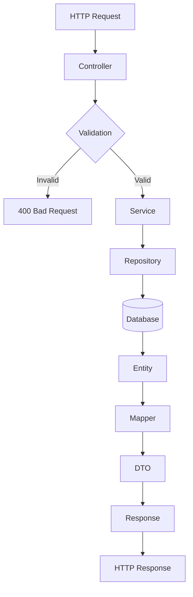

# Design Document: ASP.NET Core Backend Migration

## Overview

This document outlines the architecture and design for migrating the Get Mumm backend from Node.js/Express with Drizzle ORM to C# ASP.NET Core with clean architecture principles. The migration maintains feature parity with the existing system while improving code organization, type safety, and scalability.

The new architecture is organized into four layers: **Presentation** (API Controllers), **Application** (Services & DTOs), **Domain** (Entities & Business Logic), and **Infrastructure** (Database & External Services). This separation enables better testability, maintainability, and adherence to SOLID principles.

## High-Level Architecture

### Project Structure

```
GetMumm.Backend/
├── GetMumm.Api/                    # Presentation Layer - ASP.NET Core Controllers
│   ├── Controllers/                # REST API endpoints
│   ├── Middleware/                 # Validation, error handling, logging
│   ├── Program.cs                  # Startup configuration, DI setup
│   └── appsettings.json            # Configuration
├── GetMumm.Application/            # Application Layer - Business Logic
│   ├── Services/                   # Application services
│   ├── DTOs/                       # Data transfer objects
│   ├── Validators/                 # Validation rules
│   ├── Mappings/                   # AutoMapper profiles
│   └── Interfaces/                 # Service contracts
├── GetMumm.Domain/                 # Domain Layer - Core Entities
│   ├── Entities/                   # Domain models
│   ├── Enums/                      # Enumeration types
│   ├── Interfaces/                 # Repository & UnitOfWork contracts
│   ├── ValueObjects/               # Immutable value types
│   └── Exceptions/                 # Domain-specific exceptions
├── GetMumm.Infrastructure/         # Infrastructure Layer - Data & External Services
│   ├── Data/
│   │   ├── Contexts/               # DbContext configuration
│   │   ├── Repositories/           # Repository implementations
│   │   └── Migrations/             # EF Core migrations
│   ├── ExternalServices/           # Supabase client wrapper
│   ├── Configuration/              # DI configuration
│   └── Logging/                    # Structured logging setup
└── GetMumm.Tests/                  # Unit and integration tests
```

### Architectural Layers

#### 1. Presentation Layer (GetMumm.Api)
- **Responsibility**: HTTP request handling, routing, serialization
- **Key Components**:
  - `MenuController` - GET endpoints for categories, items, featured items
  - `ChefsController` - GET endpoints for chefs listing and details
  - `ContactController` - POST endpoint for contact forms and inquiries
  - `BlogController` - GET endpoints for blog posts
  - `SubscriptionsController` - Subscription management
  - `TestimonialsController` - GET testimonials
  - `StatsController` - System statistics
- **Middleware Stack**:
  - Exception handling middleware
  - Structured logging middleware
  - CORS middleware
  - Request validation middleware

#### 2. Application Layer (GetMumm.Application)
- **Responsibility**: Business logic orchestration, validation, DTO mapping
- **Key Components**:
  - `MenuService` - Menu operations (list items, categories, featured)
  - `ChefsService` - Chef operations (list, get by ID)
  - `ContactService` - Contact form submission
  - `BlogService` - Blog post retrieval and management
  - `SubscriptionService` - Subscription operations
  - `StatsService` - Analytics and statistics
- **Validation**: FluentValidation for request DTO validation
- **Mapping**: AutoMapper for entity-to-DTO conversions

#### 3. Domain Layer (GetMumm.Domain)
- **Responsibility**: Core business entities and rules
- **Key Entities**:
  - `MenuItem` - Menu item with pricing, dietary info, chef association
  - `Category` - Menu categories (bilingual: EN/AR)
  - `Chef` - Chef profiles with specialties and ratings
  - `BlogPost` - Blog articles with publishing workflow
  - `Contact` - Contact form submission
  - `OfficeInquiry` - B2B office catering inquiry
  - `Subscription` - User subscriptions to offerings
  - `Testimonial` - Customer reviews and testimonials
- **Enums**: Dietary restrictions, subscription types, inquiry status

#### 4. Infrastructure Layer (GetMumm.Infrastructure)
- **Responsibility**: Database access, external service integration, configuration
- **Components**:
  - `GetMummDbContext` - Entity Framework Core DbContext
  - Repository implementations for each aggregate root
  - Unit of Work pattern for transaction management
  - Supabase client wrapper for real-time features
  - Logging configuration (Serilog)

### Data Flow



## High-Level Design: Diagrams & Interfaces

### API Endpoint Structure

#### Menu Endpoints
```
GET  /api/menu/categories              - List all categories
GET  /api/menu/items                   - List menu items with filters (category, search, pagination)
GET  /api/menu/items/featured          - Get featured menu items
GET  /api/menu/items/{id}              - Get single menu item by ID
```

#### Chefs Endpoints
```
GET  /api/chefs                        - List all chefs ordered by rating
GET  /api/chefs/{id}                   - Get chef details by ID
```

#### Contact Endpoints
```
POST /api/contact                      - Submit contact form
POST /api/contact/office-inquiry       - Submit office catering inquiry
```

#### Blog Endpoints
```
GET  /api/blog                         - List blog posts with pagination
GET  /api/blog/{id}                    - Get blog post details
GET  /api/blog/{slug}                  - Get blog post by slug
```

#### Subscriptions Endpoints
```
GET  /api/subscriptions                - List available subscriptions
POST /api/subscriptions                - Create subscription
PUT  /api/subscriptions/{id}           - Update subscription
DELETE /api/subscriptions/{id}         - Cancel subscription
```

#### Statistics Endpoints
```
GET  /api/stats                        - Get system statistics
```

#### Testimonials Endpoints
```
GET  /api/testimonials                 - List testimonials
```

### Component Interfaces

#### Repository Pattern Interface
```csharp
public interface IRepository<T> where T : class
{
    Task<T> GetByIdAsync(int id, CancellationToken cancellationToken = default);
    Task<IEnumerable<T>> GetAllAsync(CancellationToken cancellationToken = default);
    Task<IEnumerable<T>> FindAsync(Expression<Func<T, bool>> predicate, 
                                    CancellationToken cancellationToken = default);
    Task<T> CreateAsync(T entity, CancellationToken cancellationToken = default);
    Task<T> UpdateAsync(T entity, CancellationToken cancellationToken = default);
    Task<bool> DeleteAsync(int id, CancellationToken cancellationToken = default);
}
```

#### Service Layer Interface Example (MenuService)
```csharp
public interface IMenuService
{
    Task<IEnumerable<CategoryDto>> GetCategoriesAsync(CancellationToken cancellationToken = default);
    Task<PaginatedResult<MenuItemDto>> GetMenuItemsAsync(MenuItemFilterDto filter, 
                                                         CancellationToken cancellationToken = default);
    Task<IEnumerable<MenuItemDto>> GetFeaturedItemsAsync(CancellationToken cancellationToken = default);
    Task<MenuItemDetailDto> GetMenuItemByIdAsync(int id, CancellationToken cancellationToken = default);
}
```

### Data Models

#### MenuItem Entity
```csharp
public class MenuItem
{
    public int Id { get; set; }
    public string Name { get; set; }
    public string NameAr { get; set; }
    public string Description { get; set; }
    public string DescriptionAr { get; set; }
    public decimal Price { get; set; }
    public int CategoryId { get; set; }
    public string CategoryName { get; set; }
    public string CategoryNameAr { get; set; }
    public string ImageUrl { get; set; }
    public string[] Dietary { get; set; } = Array.Empty<string>();
    public bool IsAvailable { get; set; } = true;
    public bool IsFeatured { get; set; } = false;
    public string ChefName { get; set; }
    public string ChefNameAr { get; set; }
    public decimal? Rating { get; set; }
    public int? PrepTimeMinutes { get; set; }
    public DateTime CreatedAt { get; set; }
    
    // Navigation
    public virtual Category Category { get; set; }
    public virtual Chef Chef { get; set; }
}
```

#### Chef Entity
```csharp
public class Chef
{
    public int Id { get; set; }
    public string Name { get; set; }
    public string NameAr { get; set; }
    public string Bio { get; set; }
    public string BioAr { get; set; }
    public string ImageUrl { get; set; }
    public string[] Specialties { get; set; } = Array.Empty<string>();
    public string[] SpecialtiesAr { get; set; } = Array.Empty<string>();
    public int ItemCount { get; set; }
    public decimal Rating { get; set; } = 4.8m;
    public int JoinedYear { get; set; }
    public DateTime CreatedAt { get; set; }
    
    // Navigation
    public virtual ICollection<MenuItem> MenuItems { get; set; } = new List<MenuItem>();
}
```

#### Contact Entity
```csharp
public class Contact
{
    public int Id { get; set; }
    public string Name { get; set; }
    public string Email { get; set; }
    public string Phone { get; set; }
    public string Message { get; set; }
    public string Subject { get; set; }
    public DateTime CreatedAt { get; set; }
}
```

#### OfficeInquiry Entity
```csharp
public class OfficeInquiry
{
    public int Id { get; set; }
    public string CompanyName { get; set; }
    public string ContactName { get; set; }
    public string Email { get; set; }
    public string Phone { get; set; }
    public int HeadCount { get; set; }
    public string DeliveryArea { get; set; }
    public string Frequency { get; set; }
    public string Message { get; set; }
    public DateTime CreatedAt { get; set; }
}
```


## Low-Level Design: Controller Signatures & Routing

### MenuController
```csharp
[ApiController]
[Route("api/menu")]
public class MenuController : ControllerBase
{
    private readonly IMenuService _menuService;
    
    public MenuController(IMenuService menuService) => _menuService = menuService;
    
    /// <summary>Get all menu categories</summary>
    [HttpGet("categories")]
    [ProduceResponseType(typeof(ListCategoriesResponse), StatusCodes.Status200OK)]
    [ProduceResponseType(StatusCodes.Status500InternalServerError)]
    public async Task<ActionResult<ListCategoriesResponse>> GetCategories(
        CancellationToken cancellationToken = default)
    {
        var categories = await _menuService.GetCategoriesAsync(cancellationToken);
        return Ok(new ListCategoriesResponse { Data = categories });
    }
    
    /// <summary>Get featured menu items</summary>
    [HttpGet("items/featured")]
    [ProduceResponseType(typeof(GetFeaturedItemsResponse), StatusCodes.Status200OK)]
    [ProduceResponseType(StatusCodes.Status500InternalServerError)]
    public async Task<ActionResult<GetFeaturedItemsResponse>> GetFeaturedItems(
        CancellationToken cancellationToken = default)
    {
        var items = await _menuService.GetFeaturedItemsAsync(cancellationToken);
        return Ok(new GetFeaturedItemsResponse { Data = items });
    }
    
    /// <summary>Get menu items with optional filters</summary>
    [HttpGet("items")]
    [ProduceResponseType(typeof(ListMenuItemsResponse), StatusCodes.Status200OK)]
    [ProduceResponseType(StatusCodes.Status400BadRequest)]
    [ProduceResponseType(StatusCodes.Status500InternalServerError)]
    public async Task<ActionResult<ListMenuItemsResponse>> GetMenuItems(
        [FromQuery] MenuItemFilterDto filter,
        CancellationToken cancellationToken = default)
    {
        var items = await _menuService.GetMenuItemsAsync(filter, cancellationToken);
        return Ok(new ListMenuItemsResponse { Data = items });
    }
    
    /// <summary>Get single menu item by ID</summary>
    [HttpGet("items/{id}")]
    [ProduceResponseType(typeof(GetMenuItemResponse), StatusCodes.Status200OK)]
    [ProduceResponseType(StatusCodes.Status404NotFound)]
    [ProduceResponseType(StatusCodes.Status500InternalServerError)]
    public async Task<ActionResult<GetMenuItemResponse>> GetMenuItemById(
        int id,
        CancellationToken cancellationToken = default)
    {
        var item = await _menuService.GetMenuItemByIdAsync(id, cancellationToken);
        if (item == null)
            return NotFound();
        return Ok(new GetMenuItemResponse { Data = item });
    }
}
```

### ChefsController
```csharp
[ApiController]
[Route("api/chefs")]
public class ChefsController : ControllerBase
{
    private readonly IChefsService _chefsService;
    
    public ChefsController(IChefsService chefsService) => _chefsService = chefsService;
    
    /// <summary>Get all chefs ordered by rating</summary>
    [HttpGet]
    [ProduceResponseType(typeof(ListChefsResponse), StatusCodes.Status200OK)]
    [ProduceResponseType(StatusCodes.Status500InternalServerError)]
    public async Task<ActionResult<ListChefsResponse>> GetAllChefs(
        CancellationToken cancellationToken = default)
    {
        var chefs = await _chefsService.GetAllChefsAsync(cancellationToken);
        return Ok(new ListChefsResponse { Data = chefs });
    }
    
    /// <summary>Get single chef by ID</summary>
    [HttpGet("{id}")]
    [ProduceResponseType(typeof(GetChefResponse), StatusCodes.Status200OK)]
    [ProduceResponseType(StatusCodes.Status404NotFound)]
    [ProduceResponseType(StatusCodes.Status500InternalServerError)]
    public async Task<ActionResult<GetChefResponse>> GetChefById(
        int id,
        CancellationToken cancellationToken = default)
    {
        var chef = await _chefsService.GetChefByIdAsync(id, cancellationToken);
        if (chef == null)
            return NotFound();
        return Ok(new GetChefResponse { Data = chef });
    }
}
```

### ContactController
```csharp
[ApiController]
[Route("api/contact")]
public class ContactController : ControllerBase
{
    private readonly IContactService _contactService;
    
    public ContactController(IContactService contactService) => _contactService = contactService;
    
    /// <summary>Submit a contact form</summary>
    [HttpPost]
    [ProduceResponseType(StatusCodes.Status200OK)]
    [ProduceResponseType(StatusCodes.Status400BadRequest)]
    [ProduceResponseType(StatusCodes.Status500InternalServerError)]
    public async Task<ActionResult> SubmitContact(
        [FromBody] SubmitContactRequest request,
        CancellationToken cancellationToken = default)
    {
        await _contactService.SubmitContactAsync(request, cancellationToken);
        return Ok(new { Message = "Contact submitted successfully" });
    }
    
    /// <summary>Submit an office catering inquiry</summary>
    [HttpPost("office-inquiry")]
    [ProduceResponseType(StatusCodes.Status200OK)]
    [ProduceResponseType(StatusCodes.Status400BadRequest)]
    [ProduceResponseType(StatusCodes.Status500InternalServerError)]
    public async Task<ActionResult> SubmitOfficeInquiry(
        [FromBody] SubmitOfficeInquiryRequest request,
        CancellationToken cancellationToken = default)
    {
        await _contactService.SubmitOfficeInquiryAsync(request, cancellationToken);
        return Ok(new { Message = "Office inquiry submitted successfully" });
    }
}
```

## Service Layer Signatures

### IMenuService
```csharp
public interface IMenuService
{
    Task<IEnumerable<CategoryDto>> GetCategoriesAsync(
        CancellationToken cancellationToken = default);
    
    Task<PaginatedResult<MenuItemDto>> GetMenuItemsAsync(
        MenuItemFilterDto filter,
        CancellationToken cancellationToken = default);
    
    Task<IEnumerable<MenuItemDto>> GetFeaturedItemsAsync(
        CancellationToken cancellationToken = default);
    
    Task<MenuItemDetailDto> GetMenuItemByIdAsync(
        int id,
        CancellationToken cancellationToken = default);
}

public class MenuService : IMenuService
{
    private readonly IRepository<MenuItem> _menuItemRepository;
    private readonly IRepository<Category> _categoryRepository;
    private readonly IMapper _mapper;
    
    public MenuService(
        IRepository<MenuItem> menuItemRepository,
        IRepository<Category> categoryRepository,
        IMapper mapper)
    {
        _menuItemRepository = menuItemRepository;
        _categoryRepository = categoryRepository;
        _mapper = mapper;
    }
    
    public async Task<IEnumerable<CategoryDto>> GetCategoriesAsync(
        CancellationToken cancellationToken = default)
    {
        var categories = await _categoryRepository.GetAllAsync(cancellationToken);
        return _mapper.Map<IEnumerable<CategoryDto>>(categories);
    }
    
    public async Task<PaginatedResult<MenuItemDto>> GetMenuItemsAsync(
        MenuItemFilterDto filter,
        CancellationToken cancellationToken = default)
    {
        var predicate = BuildMenuItemPredicate(filter);
        var items = await _menuItemRepository.FindAsync(predicate, cancellationToken);
        
        var paginatedItems = items
            .Skip((filter.Page - 1) * filter.PageSize)
            .Take(filter.PageSize)
            .ToList();
        
        return new PaginatedResult<MenuItemDto>
        {
            Data = _mapper.Map<IEnumerable<MenuItemDto>>(paginatedItems),
            Total = items.Count(),
            Page = filter.Page,
            PageSize = filter.PageSize
        };
    }
    
    public async Task<IEnumerable<MenuItemDto>> GetFeaturedItemsAsync(
        CancellationToken cancellationToken = default)
    {
        var items = await _menuItemRepository.FindAsync(
            x => x.IsFeatured && x.IsAvailable,
            cancellationToken);
        return _mapper.Map<IEnumerable<MenuItemDto>>(items);
    }
    
    public async Task<MenuItemDetailDto> GetMenuItemByIdAsync(
        int id,
        CancellationToken cancellationToken = default)
    {
        var item = await _menuItemRepository.GetByIdAsync(id, cancellationToken);
        return _mapper.Map<MenuItemDetailDto>(item);
    }
    
    private static Expression<Func<MenuItem, bool>> BuildMenuItemPredicate(
        MenuItemFilterDto filter)
    {
        return item => 
            item.IsAvailable &&
            (filter.CategoryId == null || item.CategoryId == filter.CategoryId) &&
            (string.IsNullOrEmpty(filter.Search) ||
             item.Name.Contains(filter.Search) ||
             item.NameAr.Contains(filter.Search));
    }
}
```

### IChefsService
```csharp
public interface IChefsService
{
    Task<IEnumerable<ChefDto>> GetAllChefsAsync(
        CancellationToken cancellationToken = default);
    
    Task<ChefDetailDto> GetChefByIdAsync(
        int id,
        CancellationToken cancellationToken = default);
}

public class ChefsService : IChefsService
{
    private readonly IRepository<Chef> _chefRepository;
    private readonly IMapper _mapper;
    
    public ChefsService(
        IRepository<Chef> chefRepository,
        IMapper mapper)
    {
        _chefRepository = chefRepository;
        _mapper = mapper;
    }
    
    public async Task<IEnumerable<ChefDto>> GetAllChefsAsync(
        CancellationToken cancellationToken = default)
    {
        var chefs = await _chefRepository.GetAllAsync(cancellationToken);
        return _mapper.Map<IEnumerable<ChefDto>>(
            chefs.OrderByDescending(c => c.Rating));
    }
    
    public async Task<ChefDetailDto> GetChefByIdAsync(
        int id,
        CancellationToken cancellationToken = default)
    {
        var chef = await _chefRepository.GetByIdAsync(id, cancellationToken);
        return _mapper.Map<ChefDetailDto>(chef);
    }
}
```


## Repository Pattern Implementation

### Generic Repository Interface
```csharp
public interface IRepository<T> where T : class
{
    /// <summary>Get entity by ID</summary>
    /// <precondition>id > 0</precondition>
    /// <postcondition>Returns entity if found, null otherwise</postcondition>
    Task<T> GetByIdAsync(int id, CancellationToken cancellationToken = default);
    
    /// <summary>Get all entities</summary>
    /// <postcondition>Returns complete collection of entities</postcondition>
    Task<IEnumerable<T>> GetAllAsync(CancellationToken cancellationToken = default);
    
    /// <summary>Find entities matching predicate</summary>
    /// <precondition>predicate != null</precondition>
    /// <postcondition>Returns filtered collection matching predicate</postcondition>
    Task<IEnumerable<T>> FindAsync(
        Expression<Func<T, bool>> predicate,
        CancellationToken cancellationToken = default);
    
    /// <summary>Create new entity</summary>
    /// <precondition>entity != null</precondition>
    /// <postcondition>Entity persisted to database with assigned ID</postcondition>
    Task<T> CreateAsync(T entity, CancellationToken cancellationToken = default);
    
    /// <summary>Update existing entity</summary>
    /// <precondition>entity != null && entity.Id > 0</precondition>
    /// <postcondition>Entity updated in database</postcondition>
    Task<T> UpdateAsync(T entity, CancellationToken cancellationToken = default);
    
    /// <summary>Delete entity by ID</summary>
    /// <precondition>id > 0</precondition>
    /// <postcondition>Entity removed from database; returns true if successful</postcondition>
    Task<bool> DeleteAsync(int id, CancellationToken cancellationToken = default);
}
```

### Generic Repository Implementation
```csharp
public class Repository<T> : IRepository<T> where T : class
{
    private readonly GetMummDbContext _context;
    private readonly DbSet<T> _dbSet;
    
    public Repository(GetMummDbContext context)
    {
        _context = context;
        _dbSet = context.Set<T>();
    }
    
    public async Task<T> GetByIdAsync(int id, CancellationToken cancellationToken = default)
    {
        if (id <= 0)
            throw new ArgumentException("ID must be greater than 0", nameof(id));
        
        return await _dbSet.FindAsync(new object[] { id }, cancellationToken: cancellationToken);
    }
    
    public async Task<IEnumerable<T>> GetAllAsync(CancellationToken cancellationToken = default)
    {
        return await _dbSet.ToListAsync(cancellationToken);
    }
    
    public async Task<IEnumerable<T>> FindAsync(
        Expression<Func<T, bool>> predicate,
        CancellationToken cancellationToken = default)
    {
        if (predicate == null)
            throw new ArgumentNullException(nameof(predicate));
        
        return await _dbSet.Where(predicate).ToListAsync(cancellationToken);
    }
    
    public async Task<T> CreateAsync(T entity, CancellationToken cancellationToken = default)
    {
        if (entity == null)
            throw new ArgumentNullException(nameof(entity));
        
        await _dbSet.AddAsync(entity, cancellationToken);
        await _context.SaveChangesAsync(cancellationToken);
        return entity;
    }
    
    public async Task<T> UpdateAsync(T entity, CancellationToken cancellationToken = default)
    {
        if (entity == null)
            throw new ArgumentNullException(nameof(entity));
        
        _dbSet.Update(entity);
        await _context.SaveChangesAsync(cancellationToken);
        return entity;
    }
    
    public async Task<bool> DeleteAsync(int id, CancellationToken cancellationToken = default)
    {
        if (id <= 0)
            throw new ArgumentException("ID must be greater than 0", nameof(id));
        
        var entity = await GetByIdAsync(id, cancellationToken);
        if (entity == null)
            return false;
        
        _dbSet.Remove(entity);
        await _context.SaveChangesAsync(cancellationToken);
        return true;
    }
}
```

## DTO Structures

### MenuItemDTO
```csharp
public class MenuItemDto
{
    public int Id { get; set; }
    public string Name { get; set; }
    public string NameAr { get; set; }
    public string Description { get; set; }
    public string DescriptionAr { get; set; }
    public decimal Price { get; set; }
    public string CategoryName { get; set; }
    public string CategoryNameAr { get; set; }
    public string ImageUrl { get; set; }
    public string[] Dietary { get; set; }
    public bool IsAvailable { get; set; }
    public string ChefName { get; set; }
    public decimal? Rating { get; set; }
    public int? PrepTimeMinutes { get; set; }
}

public class MenuItemDetailDto : MenuItemDto
{
    public int CategoryId { get; set; }
    public ChefDetailDto Chef { get; set; }
}
```

### CategoryDTO
```csharp
public class CategoryDto
{
    public int Id { get; set; }
    public string Name { get; set; }
    public string NameAr { get; set; }
    public string Description { get; set; }
    public string DescriptionAr { get; set; }
    public string ImageUrl { get; set; }
    public int ItemCount { get; set; }
}
```

### ChefDTO
```csharp
public class ChefDto
{
    public int Id { get; set; }
    public string Name { get; set; }
    public string NameAr { get; set; }
    public string Bio { get; set; }
    public string BioAr { get; set; }
    public string ImageUrl { get; set; }
    public string[] Specialties { get; set; }
    public string[] SpecialtiesAr { get; set; }
    public int ItemCount { get; set; }
    public decimal Rating { get; set; }
}

public class ChefDetailDto : ChefDto
{
    public int JoinedYear { get; set; }
}
```

### Request/Response DTOs
```csharp
public class MenuItemFilterDto
{
    public int? CategoryId { get; set; }
    public string Search { get; set; }
    public int Page { get; set; } = 1;
    public int PageSize { get; set; } = 10;
}

public class ListCategoriesResponse
{
    public IEnumerable<CategoryDto> Data { get; set; }
}

public class ListMenuItemsResponse
{
    public IEnumerable<MenuItemDto> Data { get; set; }
    public PaginationMetadata Pagination { get; set; }
}

public class PaginatedResult<T>
{
    public IEnumerable<T> Data { get; set; }
    public int Total { get; set; }
    public int Page { get; set; }
    public int PageSize { get; set; }
}

public class SubmitContactRequest
{
    public string Name { get; set; }
    public string Email { get; set; }
    public string Phone { get; set; }
    public string Message { get; set; }
    public string Subject { get; set; }
}
```

## Validation Approach

### FluentValidation Validators
```csharp
public class SubmitContactRequestValidator : AbstractValidator<SubmitContactRequest>
{
    public SubmitContactRequestValidator()
    {
        RuleFor(x => x.Name)
            .NotEmpty().WithMessage("Name is required")
            .MaximumLength(100).WithMessage("Name must not exceed 100 characters");
        
        RuleFor(x => x.Email)
            .NotEmpty().WithMessage("Email is required")
            .EmailAddress().WithMessage("Invalid email format");
        
        RuleFor(x => x.Phone)
            .Matches(@"^\+?[\d\s\-()]{7,}$")
            .When(x => !string.IsNullOrEmpty(x.Phone))
            .WithMessage("Invalid phone format");
        
        RuleFor(x => x.Message)
            .NotEmpty().WithMessage("Message is required")
            .MinimumLength(10).WithMessage("Message must be at least 10 characters");
        
        RuleFor(x => x.Subject)
            .NotEmpty().WithMessage("Subject is required")
            .MaximumLength(200).WithMessage("Subject must not exceed 200 characters");
    }
}

public class MenuItemFilterDtoValidator : AbstractValidator<MenuItemFilterDto>
{
    public MenuItemFilterDtoValidator()
    {
        RuleFor(x => x.Page)
            .GreaterThan(0).WithMessage("Page must be greater than 0");
        
        RuleFor(x => x.PageSize)
            .GreaterThan(0).WithMessage("PageSize must be greater than 0")
            .LessThanOrEqualTo(100).WithMessage("PageSize must not exceed 100");
    }
}
```


## Middleware Pipeline

### Middleware Configuration (Program.cs)
```csharp
var builder = WebApplicationBuilder.CreateBuilder(args);

// Add logging
builder.Services.AddLogging(config =>
{
    config.ClearProviders();
    config.AddSerilog(new LoggerConfiguration()
        .MinimumLevel.Information()
        .WriteTo.Console(new CompactJsonFormatter())
        .WriteTo.File("logs/app-.txt", rollingInterval: RollingInterval.Day)
        .CreateLogger());
});

// Add services
builder.Services.AddControllers();
builder.Services.AddCors(options =>
{
    options.AddPolicy("AllowFrontend", policy =>
    {
        policy.WithOrigins(builder.Configuration["Cors:AllowedOrigins"].Split(","))
              .AllowAnyMethod()
              .AllowAnyHeader();
    });
});

// Database
builder.Services.AddDbContext<GetMummDbContext>(options =>
    options.UseNpgsql(builder.Configuration.GetConnectionString("DefaultConnection"),
        x => x.MigrationsAssembly("GetMumm.Infrastructure")));

// AutoMapper
builder.Services.AddAutoMapper(typeof(MappingProfile));

// FluentValidation
builder.Services.AddFluentValidationAutoValidation();
builder.Services.AddValidatorsFromAssembly(typeof(Program).Assembly);

// Repositories and Services
builder.Services.AddScoped(typeof(IRepository<>), typeof(Repository<>));
builder.Services.AddScoped<IMenuService, MenuService>();
builder.Services.AddScoped<IChefsService, ChefsService>();
builder.Services.AddScoped<IContactService, ContactService>();
// ... other services

// Build pipeline
var app = builder.Build();

// Middleware order matters
app.UseSerilogRequestLogging();
app.UseExceptionHandlingMiddleware();
app.UseHttpsRedirection();
app.UseCors("AllowFrontend");
app.MapControllers();

app.Run();
```

### Exception Handling Middleware
```csharp
public class ExceptionHandlingMiddleware
{
    private readonly RequestDelegate _next;
    private readonly ILogger<ExceptionHandlingMiddleware> _logger;
    
    public ExceptionHandlingMiddleware(RequestDelegate next, 
        ILogger<ExceptionHandlingMiddleware> logger)
    {
        _next = next;
        _logger = logger;
    }
    
    public async Task InvokeAsync(HttpContext context)
    {
        try
        {
            await _next(context);
        }
        catch (Exception ex)
        {
            _logger.LogError(ex, "Unhandled exception occurred");
            await HandleExceptionAsync(context, ex);
        }
    }
    
    private static Task HandleExceptionAsync(HttpContext context, Exception exception)
    {
        context.Response.ContentType = "application/json";
        var response = new { error = exception.Message };
        
        switch (exception)
        {
            case ArgumentNullException:
            case ArgumentException:
                context.Response.StatusCode = StatusCodes.Status400BadRequest;
                break;
            case KeyNotFoundException:
                context.Response.StatusCode = StatusCodes.Status404NotFound;
                break;
            default:
                context.Response.StatusCode = StatusCodes.Status500InternalServerError;
                break;
        }
        
        return context.Response.WriteAsJsonAsync(response);
    }
}

public static class ExceptionHandlingMiddlewareExtension
{
    public static IApplicationBuilder UseExceptionHandlingMiddleware(
        this IApplicationBuilder builder)
    {
        return builder.UseMiddleware<ExceptionHandlingMiddleware>();
    }
}
```

## Database Access Pattern

### Entity Framework Core vs Dapper

**Decision**: Use Entity Framework Core with async/await patterns

**Rationale**:
- Feature parity with Drizzle ORM (both are ORMs)
- Strong LINQ support for complex queries
- Built-in lazy loading and eager loading
- Automatic change tracking simplifies mutations
- Migrations are first-class citizens
- Type-safe query construction

**Alternative approach with Dapper** (if performance critical):
- For read-heavy endpoints with complex queries
- Use Dapper alongside EF Core for specific queries
- Example: Complex reporting or analytics queries

### DbContext Configuration
```csharp
public class GetMummDbContext : DbContext
{
    public GetMummDbContext(DbContextOptions<GetMummDbContext> options)
        : base(options) { }
    
    public DbSet<Category> Categories { get; set; }
    public DbSet<MenuItem> MenuItems { get; set; }
    public DbSet<Chef> Chefs { get; set; }
    public DbSet<BlogPost> BlogPosts { get; set; }
    public DbSet<Contact> Contacts { get; set; }
    public DbSet<OfficeInquiry> OfficeInquiries { get; set; }
    public DbSet<Subscription> Subscriptions { get; set; }
    public DbSet<Testimonial> Testimonials { get; set; }
    
    protected override void OnModelCreating(ModelBuilder modelBuilder)
    {
        base.OnModelCreating(modelBuilder);
        
        // Configure entity relationships
        modelBuilder.Entity<MenuItem>()
            .HasOne(m => m.Category)
            .WithMany()
            .HasForeignKey(m => m.CategoryId)
            .OnDelete(DeleteBehavior.Cascade);
        
        modelBuilder.Entity<MenuItem>()
            .HasOne(m => m.Chef)
            .WithMany(c => c.MenuItems)
            .HasForeignKey(m => m.ChefId)
            .OnDelete(DeleteBehavior.Cascade);
        
        // Apply query filters
        modelBuilder.Entity<MenuItem>()
            .HasQueryFilter(m => !m.IsDeleted);
    }
}
```

## Database Migration Strategy

### Migration Structure
```
Infrastructure/Migrations/
├── 20240101000000_InitialCreate.cs
├── 20240102000000_AddBilingual.cs
├── 20240103000000_AddForeignKeys.cs
└── 20240104000000_AddConstraints.cs
```

### Migration File Example
```csharp
public partial class InitialCreate : Migration
{
    protected override void Up(MigrationBuilder migrationBuilder)
    {
        migrationBuilder.CreateTable(
            name: "categories",
            columns: table => new
            {
                id = table.Column<int>(type: "integer", nullable: false)
                    .Annotation("Npgsql:ValueGenerationStrategy", 
                        NpgsqlValueGenerationStrategy.IdentityByDefaultColumn),
                name = table.Column<string>(type: "text", nullable: false),
                name_ar = table.Column<string>(type: "text", nullable: false),
                slug = table.Column<string>(type: "text", nullable: false),
                description = table.Column<string>(type: "text", nullable: false),
                description_ar = table.Column<string>(type: "text", nullable: false),
                image_url = table.Column<string>(type: "text", nullable: false),
                item_count = table.Column<int>(type: "integer", nullable: false),
                created_at = table.Column<DateTime>(type: "timestamp with time zone", 
                    nullable: false, defaultValueSql: "now()"),
                is_deleted = table.Column<bool>(type: "boolean", nullable: false)
            },
            constraints: table =>
            {
                table.PrimaryKey("PK_categories", x => x.id);
                table.UniqueConstraint("UQ_categories_slug", x => x.slug);
            });
    }
    
    protected override void Down(MigrationBuilder migrationBuilder)
    {
        migrationBuilder.DropTable(name: "categories");
    }
}
```

### Migration Commands
```bash
# Create new migration
dotnet ef migrations add MigrationName --project GetMumm.Infrastructure

# Apply migrations to database
dotnet ef database update --project GetMumm.Infrastructure

# Revert last migration
dotnet ef migrations remove --project GetMumm.Infrastructure

# Generate SQL script
dotnet ef migrations script --project GetMumm.Infrastructure
```

## Supabase Integration Approach

### Supabase Client Wrapper
```csharp
public interface ISupabaseService
{
    Task<bool> InsertContactAsync(Contact contact, CancellationToken cancellationToken = default);
    Task<bool> InsertOfficeInquiryAsync(OfficeInquiry inquiry, CancellationToken cancellationToken = default);
    Task<IEnumerable<T>> QueryAsync<T>(string table, CancellationToken cancellationToken = default);
}

public class SupabaseService : ISupabaseService
{
    private readonly Client _supabaseClient;
    private readonly ILogger<SupabaseService> _logger;
    
    public SupabaseService(IConfiguration configuration, 
        ILogger<SupabaseService> logger)
    {
        var supabaseUrl = configuration["Supabase:Url"];
        var supabaseKey = configuration["Supabase:Key"];
        var options = new SupabaseOptions { AutoRefreshToken = true };
        
        _supabaseClient = new Client(supabaseUrl, supabaseKey, options);
        _logger = logger;
    }
    
    public async Task<bool> InsertContactAsync(Contact contact, 
        CancellationToken cancellationToken = default)
    {
        try
        {
            var response = await _supabaseClient
                .From("contacts")
                .Insert(new
                {
                    name = contact.Name,
                    email = contact.Email,
                    phone = contact.Phone,
                    message = contact.Message,
                    subject = contact.Subject,
                    created_at = DateTime.UtcNow
                });
            
            _logger.LogInformation("Contact inserted to Supabase: {ContactId}", contact.Id);
            return true;
        }
        catch (Exception ex)
        {
            _logger.LogError(ex, "Failed to insert contact to Supabase");
            return false;
        }
    }
    
    public async Task<bool> InsertOfficeInquiryAsync(OfficeInquiry inquiry, 
        CancellationToken cancellationToken = default)
    {
        try
        {
            await _supabaseClient
                .From("office_inquiries")
                .Insert(new
                {
                    company_name = inquiry.CompanyName,
                    contact_name = inquiry.ContactName,
                    email = inquiry.Email,
                    phone = inquiry.Phone,
                    head_count = inquiry.HeadCount,
                    delivery_area = inquiry.DeliveryArea,
                    frequency = inquiry.Frequency,
                    message = inquiry.Message,
                    created_at = DateTime.UtcNow
                });
            
            _logger.LogInformation("Office inquiry inserted to Supabase: {InquiryId}", 
                inquiry.Id);
            return true;
        }
        catch (Exception ex)
        {
            _logger.LogError(ex, "Failed to insert office inquiry to Supabase");
            return false;
        }
    }
    
    public async Task<IEnumerable<T>> QueryAsync<T>(string table, 
        CancellationToken cancellationToken = default)
    {
        try
        {
            var response = await _supabaseClient.From(table).Select("*").Get();
            return response.Models<T>();
        }
        catch (Exception ex)
        {
            _logger.LogError(ex, "Failed to query {Table} from Supabase", table);
            return Enumerable.Empty<T>();
        }
    }
}
```

### Hybrid Write Strategy (Fallback Pattern)
```csharp
public class ContactService : IContactService
{
    private readonly IRepository<Contact> _contactRepository;
    private readonly ISupabaseService _supabaseService;
    private readonly ILogger<ContactService> _logger;
    
    public ContactService(
        IRepository<Contact> contactRepository,
        ISupabaseService supabaseService,
        ILogger<ContactService> logger)
    {
        _contactRepository = contactRepository;
        _supabaseService = supabaseService;
        _logger = logger;
    }
    
    public async Task SubmitContactAsync(SubmitContactRequest request, 
        CancellationToken cancellationToken = default)
    {
        var contact = new Contact
        {
            Name = request.Name,
            Email = request.Email,
            Phone = request.Phone,
            Message = request.Message,
            Subject = request.Subject,
            CreatedAt = DateTime.UtcNow
        };
        
        // Primary: Write to PostgreSQL
        await _contactRepository.CreateAsync(contact, cancellationToken);
        
        // Secondary: Sync to Supabase (fire and forget)
        _ = _supabaseService.InsertContactAsync(contact, cancellationToken)
            .ContinueWith(task =>
            {
                if (task.IsFaulted)
                {
                    _logger.LogWarning("Failed to sync contact to Supabase, but primary write succeeded");
                }
            });
    }
}
```


## Error Handling Strategy

### Custom Exception Hierarchy
```csharp
public abstract class ApplicationException : Exception
{
    public int StatusCode { get; protected set; }
    
    protected ApplicationException(string message, int statusCode = 500)
        : base(message) => StatusCode = statusCode;
}

public class NotFoundException : ApplicationException
{
    public NotFoundException(string message)
        : base(message, StatusCodes.Status404NotFound) { }
}

public class BadRequestException : ApplicationException
{
    public BadRequestException(string message)
        : base(message, StatusCodes.Status400BadRequest) { }
}

public class ValidationException : ApplicationException
{
    public Dictionary<string, string[]> Errors { get; }
    
    public ValidationException(Dictionary<string, string[]> errors)
        : base("Validation failed", StatusCodes.Status400BadRequest)
        => Errors = errors;
}
```

### Error Response Structure
```csharp
public class ErrorResponse
{
    public string Type { get; set; }
    public string Message { get; set; }
    public Dictionary<string, string[]> Errors { get; set; }
    public string TraceId { get; set; }
    public DateTime Timestamp { get; set; }
}

// Usage in middleware
private static Task HandleExceptionAsync(HttpContext context, Exception exception)
{
    context.Response.ContentType = "application/json";
    
    var errorResponse = new ErrorResponse
    {
        Timestamp = DateTime.UtcNow,
        TraceId = context.TraceIdentifier
    };
    
    if (exception is ApplicationException appEx)
    {
        context.Response.StatusCode = appEx.StatusCode;
        errorResponse.Type = exception.GetType().Name;
        errorResponse.Message = exception.Message;
        
        if (exception is ValidationException valEx)
        {
            errorResponse.Errors = valEx.Errors;
        }
    }
    else
    {
        context.Response.StatusCode = StatusCodes.Status500InternalServerError;
        errorResponse.Type = "InternalServerError";
        errorResponse.Message = "An unexpected error occurred";
    }
    
    return context.Response.WriteAsJsonAsync(errorResponse);
}
```

## Logging Strategy

### Structured Logging with Serilog
```csharp
public class ServiceLoggingBehavior<TRequest, TResponse> : IPipelineBehavior<TRequest, TResponse>
    where TRequest : IRequest<TResponse>
{
    private readonly ILogger<ServiceLoggingBehavior<TRequest, TResponse>> _logger;
    
    public ServiceLoggingBehavior(ILogger<ServiceLoggingBehavior<TRequest, TResponse>> logger)
        => _logger = logger;
    
    public async Task<TResponse> Handle(TRequest request, RequestHandlerDelegate<TResponse> next,
        CancellationToken cancellationToken)
    {
        var requestName = typeof(TRequest).Name;
        _logger.LogInformation("Starting request {RequestName}", requestName);
        
        try
        {
            var response = await next();
            _logger.LogInformation("Completed request {RequestName}", requestName);
            return response;
        }
        catch (Exception ex)
        {
            _logger.LogError(ex, "Request {RequestName} failed with error", requestName);
            throw;
        }
    }
}
```

### Log Format Configuration
```json
{
  "Serilog": {
    "MinimumLevel": "Information",
    "WriteTo": [
      {
        "Name": "Console",
        "Args": {
          "formatter": "Serilog.Formatting.Json.JsonFormatter"
        }
      },
      {
        "Name": "File",
        "Args": {
          "path": "logs/app-.txt",
          "rollingInterval": "Day",
          "outputTemplate": "{Timestamp:yyyy-MM-dd HH:mm:ss.fff zzz} [{Level:u3}] {Message:lj}{NewLine}{Exception}"
        }
      }
    ],
    "Enrich": [
      "FromLogContext",
      "WithMachineName",
      "WithThreadId"
    ]
  }
}
```

## Configuration Management

### Configuration Structure
```
appsettings.json
├── ConnectionStrings
│   └── DefaultConnection
├── Logging
├── Database
├── Supabase
├── Cors
└── Jwt

appsettings.Development.json
appsettings.Production.json
```

### Configuration Example
```json
{
  "ConnectionStrings": {
    "DefaultConnection": "Host=localhost;Port=5432;Database=get_mumm;Username=user;Password=password"
  },
  "Database": {
    "Provider": "PostgreSQL",
    "EnableMigrations": true,
    "CommandTimeout": 30
  },
  "Supabase": {
    "Url": "https://your-project.supabase.co",
    "Key": "your-anon-key"
  },
  "Cors": {
    "AllowedOrigins": "http://localhost:3000,https://get-mumm.com"
  },
  "Logging": {
    "LogLevel": {
      "Default": "Information",
      "Microsoft": "Warning"
    }
  }
}
```

### Configuration Loading (Program.cs)
```csharp
var builder = WebApplicationBuilder.CreateBuilder(args);

// Load environment-specific config
builder.Configuration
    .AddJsonFile("appsettings.json", optional: false, reloadOnChange: true)
    .AddJsonFile($"appsettings.{builder.Environment.EnvironmentName}.json", 
        optional: true, reloadOnChange: true)
    .AddEnvironmentVariables();

// Map configuration to strongly-typed classes
builder.Services.Configure<DatabaseSettings>(
    builder.Configuration.GetSection("Database"));
builder.Services.Configure<SupabaseSettings>(
    builder.Configuration.GetSection("Supabase"));
```

## Dependency Injection Setup

### Service Registration (Program.cs)
```csharp
public static class ServiceCollectionExtensions
{
    public static IServiceCollection AddApplicationServices(
        this IServiceCollection services)
    {
        // Repositories
        services.AddScoped(typeof(IRepository<>), typeof(Repository<>));
        
        // Services
        services.AddScoped<IMenuService, MenuService>();
        services.AddScoped<IChefsService, ChefsService>();
        services.AddScoped<IContactService, ContactService>();
        services.AddScoped<IBlogService, BlogService>();
        services.AddScoped<ISubscriptionService, SubscriptionService>();
        services.AddScoped<ITestimonialService, TestimonialService>();
        services.AddScoped<IStatsService, StatsService>();
        
        // External Services
        services.AddScoped<ISupabaseService, SupabaseService>();
        
        // Validators
        services.AddFluentValidationAutoValidation();
        services.AddValidatorsFromAssemblyContaining<Program>();
        
        // Mappings
        services.AddAutoMapper(typeof(Program).Assembly);
        
        return services;
    }
    
    public static IServiceCollection AddInfrastructureServices(
        this IServiceCollection services, IConfiguration configuration)
    {
        services.AddDbContext<GetMummDbContext>(options =>
            options.UseNpgsql(
                configuration.GetConnectionString("DefaultConnection"),
                x => x.MigrationsAssembly("GetMumm.Infrastructure")));
        
        services.AddScoped<IUnitOfWork, UnitOfWork>();
        
        return services;
    }
}

// Usage in Program.cs
builder.Services
    .AddApplicationServices()
    .AddInfrastructureServices(builder.Configuration);
```

## Feature Routes Summary

### Complete API Routes Mapping
```
GET    /api/health                           - Health check
GET    /api/menu/categories                  - List categories
GET    /api/menu/items                       - List menu items (filtered, paginated)
GET    /api/menu/items/featured              - Get featured items
GET    /api/menu/items/{id}                  - Get menu item by ID
GET    /api/chefs                            - List all chefs (ordered by rating)
GET    /api/chefs/{id}                       - Get chef by ID
GET    /api/blog                             - List blog posts (paginated)
GET    /api/blog/{id}                        - Get blog post by ID
GET    /api/blog/slug/{slug}                 - Get blog post by slug
GET    /api/testimonials                     - List testimonials
GET    /api/stats                            - Get system statistics
GET    /api/subscriptions                    - List available subscriptions
POST   /api/subscriptions                    - Create subscription
PUT    /api/subscriptions/{id}               - Update subscription
DELETE /api/subscriptions/{id}               - Cancel subscription
POST   /api/contact                          - Submit contact form
POST   /api/contact/office-inquiry           - Submit office inquiry
```

## Correctness Properties

### Service Layer Invariants

#### MenuService.GetMenuItemsAsync
```
∀ filter ∈ MenuItemFilterDto:
  - Precondition: filter.Page > 0 ∧ filter.PageSize > 0 ∧ filter.PageSize ≤ 100
  - Postcondition: result ≠ null ∧ result.Data.Count ≤ filter.PageSize
  - Invariant: All returned items have IsAvailable = true
  - Invariant: If filter.CategoryId ≠ null, all items.CategoryId = filter.CategoryId
```

#### ChefsService.GetAllChefsAsync
```
∀ result ∈ ChefsService.GetAllChefsAsync():
  - Postcondition: result.Count = all chefs in database
  - Invariant: result[i].Rating ≥ result[i+1].Rating (descending order)
```

#### ContactService.SubmitContactAsync
```
∀ request ∈ SubmitContactRequest:
  - Precondition: request.Name ≠ ∅ ∧ request.Email ≠ ∅ ∧ request.Message ≠ ∅
  - Postcondition: Contact persisted to PostgreSQL
  - Side-effect: Contact synced to Supabase (fire-and-forget, non-blocking)
```

#### Repository.CreateAsync
```
∀ entity ∈ T:
  - Precondition: entity ≠ null
  - Postcondition: entity.Id > 0 ∧ entity persisted to database
  - No side-effects on input parameter (entity is copied)
```

#### Repository.UpdateAsync
```
∀ entity ∈ T:
  - Precondition: entity ≠ null ∧ entity.Id > 0
  - Postcondition: updated entity persisted to database
  - Invariant: All field updates applied atomically
```

## Testing Strategy

### Unit Testing Approach
- **Framework**: xUnit with Moq
- **Coverage Target**: 80% of service layer
- **Mocking**: Mock repositories to test service logic in isolation
- **Example**: Test MenuService filtering logic without database

### Integration Testing Approach
- **Framework**: xUnit with TestContainers (PostgreSQL)
- **Scope**: Test repository → service → controller flow
- **Database**: Real PostgreSQL in container
- **Example**: Test complete request/response cycle for menu endpoint

### Property-Based Testing Approach
- **Framework**: fast-check or similar
- **Test Library**: Identify as part of implementation
- **Focus**: Data validation and boundary conditions
- **Example**: Generate random MenuItemFilterDto objects and verify filters work correctly


## Performance Considerations

### Caching Strategy
```csharp
public interface ICacheService
{
    Task<T> GetOrSetAsync<T>(string key, Func<Task<T>> factory, 
        TimeSpan? expiration = null, CancellationToken cancellationToken = default);
    
    Task<T> GetAsync<T>(string key, CancellationToken cancellationToken = default);
    
    Task SetAsync<T>(string key, T value, TimeSpan? expiration = null,
        CancellationToken cancellationToken = default);
    
    Task RemoveAsync(string key, CancellationToken cancellationToken = default);
}

public class MenuService : IMenuService
{
    private readonly ICacheService _cacheService;
    private const string CategoriesCacheKey = "menu:categories";
    private const string FeaturedItemsCacheKey = "menu:featured";
    private static readonly TimeSpan CategoryCacheDuration = TimeSpan.FromHours(1);
    
    public async Task<IEnumerable<CategoryDto>> GetCategoriesAsync(
        CancellationToken cancellationToken = default)
    {
        return await _cacheService.GetOrSetAsync(
            CategoriesCacheKey,
            async () =>
            {
                var categories = await _categoryRepository.GetAllAsync(cancellationToken);
                return _mapper.Map<IEnumerable<CategoryDto>>(categories);
            },
            CategoryCacheDuration,
            cancellationToken);
    }
}
```

### Query Optimization
- Use AsNoTracking() for read-only queries
- Implement pagination for large result sets
- Use projection with Select() to reduce data transfer
- Implement database indexes on frequently filtered columns

```csharp
public async Task<IEnumerable<MenuItemDto>> GetFeaturedItemsAsync(
    CancellationToken cancellationToken = default)
{
    // Optimized query with projections
    var items = await _dbSet
        .Where(x => x.IsFeatured && x.IsAvailable)
        .Select(x => new MenuItemDto
        {
            Id = x.Id,
            Name = x.Name,
            NameAr = x.NameAr,
            Price = x.Price,
            ImageUrl = x.ImageUrl,
            ChefName = x.ChefName
        })
        .AsNoTracking()
        .ToListAsync(cancellationToken);
    
    return items;
}
```

### Database Indexes
```csharp
protected override void OnModelCreating(ModelBuilder modelBuilder)
{
    modelBuilder.Entity<MenuItem>()
        .HasIndex(m => m.CategoryId)
        .HasDatabaseName("IX_menu_items_category_id");
    
    modelBuilder.Entity<MenuItem>()
        .HasIndex(m => m.IsFeatured)
        .HasDatabaseName("IX_menu_items_is_featured");
    
    modelBuilder.Entity<MenuItem>()
        .HasIndex(m => m.IsAvailable)
        .HasDatabaseName("IX_menu_items_is_available");
    
    modelBuilder.Entity<Contact>()
        .HasIndex(c => c.CreatedAt)
        .HasDatabaseName("IX_contacts_created_at");
}
```

## Security Considerations

### Input Validation & Sanitization
- Use FluentValidation for all DTOs
- Escape user input for SQL injection prevention (EF Core handles parameterization)
- Rate limiting on contact endpoints
- CORS configuration restricts cross-origin requests

### API Authentication (Future Enhancement)
```csharp
public class JwtSettings
{
    public string SecretKey { get; set; }
    public string Issuer { get; set; }
    public string Audience { get; set; }
    public int ExpirationMinutes { get; set; }
}

// Add JWT authentication when required
builder.Services.AddAuthentication(JwtBearerDefaults.AuthenticationScheme)
    .AddJwtBearer(options =>
    {
        options.TokenValidationParameters = new TokenValidationParameters
        {
            ValidateIssuerSigningKey = true,
            IssuerSigningKey = new SymmetricSecurityKey(
                Encoding.UTF8.GetBytes(jwtSettings.SecretKey)),
            ValidateIssuer = true,
            ValidIssuer = jwtSettings.Issuer,
            ValidateAudience = true,
            ValidAudience = jwtSettings.Audience,
            ValidateLifetime = true
        };
    });
```

### SQL Injection Prevention
- Always use parameterized queries (EF Core default)
- Avoid string concatenation for queries
- Use LINQ for query construction

### CORS Configuration
```csharp
builder.Services.AddCors(options =>
{
    options.AddPolicy("AllowFrontend", policy =>
    {
        policy
            .WithOrigins(
                builder.Configuration["Cors:AllowedOrigins"]
                    .Split(",", StringSplitOptions.RemoveEmptyEntries))
            .AllowAnyMethod()
            .AllowAnyHeader()
            .AllowCredentials()
            .WithExposedHeaders("X-Total-Count");
    });
});
```

## Dependencies

### NuGet Packages
```xml
<!-- Core Framework -->
<PackageReference Include="Microsoft.AspNetCore.App" Version="8.0.0" />

<!-- Database -->
<PackageReference Include="Microsoft.EntityFrameworkCore" Version="8.0.0" />
<PackageReference Include="Microsoft.EntityFrameworkCore.Design" Version="8.0.0" />
<PackageReference Include="Npgsql.EntityFrameworkCore.PostgreSQL" Version="8.0.0" />

<!-- Validation -->
<PackageReference Include="FluentValidation" Version="11.8.0" />
<PackageReference Include="FluentValidation.DependencyInjectionExtensions" Version="11.8.0" />

<!-- Mapping -->
<PackageReference Include="AutoMapper" Version="13.0.0" />
<PackageReference Include="AutoMapper.Extensions.Microsoft.DependencyInjection" Version="12.0.0" />

<!-- Logging -->
<PackageReference Include="Serilog" Version="4.0.0" />
<PackageReference Include="Serilog.AspNetCore" Version="8.0.0" />
<PackageReference Include="Serilog.Sinks.Console" Version="5.0.0" />
<PackageReference Include="Serilog.Sinks.File" Version="5.0.0" />
<PackageReference Include="Serilog.Formatting.Json" Version="1.1.0" />

<!-- External Services -->
<PackageReference Include="supabase-csharp" Version="0.11.0" />

<!-- Caching -->
<PackageReference Include="StackExchange.Redis" Version="2.7.0" />

<!-- Testing -->
<PackageReference Include="xunit" Version="2.6.4" />
<PackageReference Include="Moq" Version="4.20.0" />
<PackageReference Include="TestContainers" Version="3.5.0" />
```

## Implementation Phase Overview

### Phase 1: Project Setup & Infrastructure
1. Create ASP.NET Core 8 solution with clean architecture folders
2. Configure PostgreSQL DbContext and migrations
3. Set up dependency injection and logging
4. Create base repository and generic implementations

### Phase 2: Domain Layer
1. Create domain entities mapping from Express models
2. Define entity relationships and constraints
3. Create value objects for complex types
4. Implement soft delete pattern

### Phase 3: Application Layer
1. Create DTOs for all request/response models
2. Implement service classes with business logic
3. Create FluentValidation validators
4. Configure AutoMapper profiles

### Phase 4: Presentation Layer
1. Create API controllers for all routes
2. Implement exception handling middleware
3. Configure CORS and security middleware
4. Add OpenAPI/Swagger documentation

### Phase 5: Integration & Testing
1. Create unit tests for services
2. Create integration tests with TestContainers
3. Verify Supabase fallback sync works
4. Performance testing and optimization

### Phase 6: Migration & Deployment
1. Data migration from existing PostgreSQL
2. Deployment to production environment
3. Monitoring and observability setup
4. Performance baseline establishment

## Summary

The ASP.NET Core migration maintains complete feature parity with the existing Express backend while providing:

- **Improved Code Organization**: Clear separation of concerns across four architectural layers
- **Type Safety**: Strong typing throughout the stack with minimal reflection
- **Testability**: Dependency injection and repository patterns enable isolated testing
- **Scalability**: Proper service abstraction allows for performance optimization
- **Maintainability**: SOLID principles and clear contract interfaces
- **Developer Experience**: Modern C# 12 features, async/await patterns, strong IDE support

The design prioritizes gradual migration, allowing parallel operation of old and new systems during transition, with Supabase as the integration point for data synchronization.

